# Network System Homework 3

> 109550004 紀政良

## Code Test

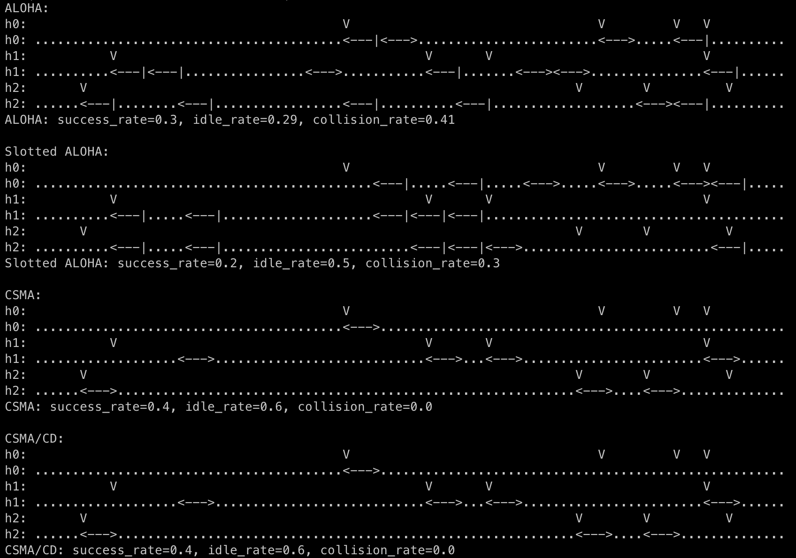

## Questions

### Question 1

>   Apply the following settings in all methods and plot the results.

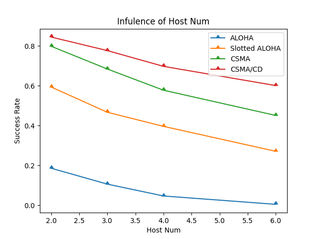

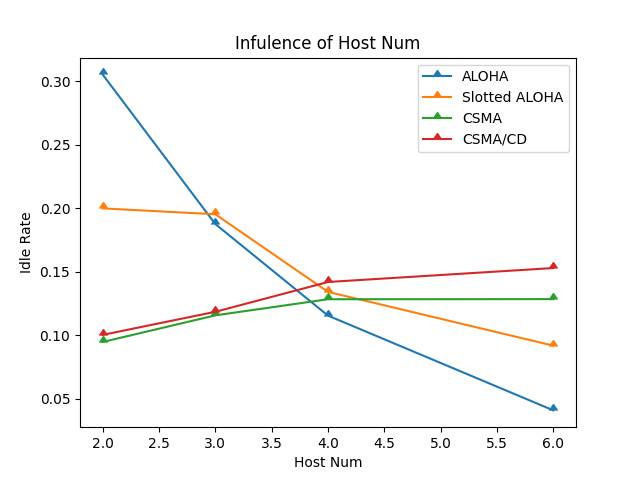

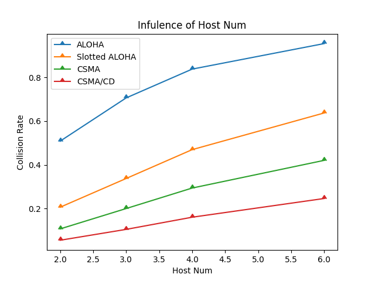

### Question 2

>   Define two expressions, one for calculating `max_collision_wait_time` and another for calculating `p_resend`, which should both include a coefficient parameter $$c \geq 1$$ and other parameters. Write down the expressions in your report and modify the `Setting` class accordingly. (The subsequent questions 3~8 will be based on this new setting.) 

-   $$max\_collision\_wait\_time=host\_num \times packet\_size \times coefficient$$
-   $$p\_resend=\frac{1}{host\_num\times coefficient}$$

### Question 3

>   Redo the simulations from question 1 using the updated settings for all methods. Plot the results and describe the influence of using these expressions.

We can see that the success rate increases after we defined the expressions in comparision with the method without the expression. Moreover, it will not decrease as the host_num increase, since we constructed an adaptive control system that uses the reasonable parameter for each scenario.

We can also find that the collision rate is lower than before after we defined the expressions for `max_collision_wait_time` and `p_resend`.

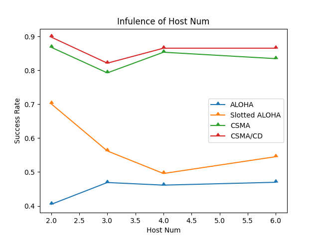

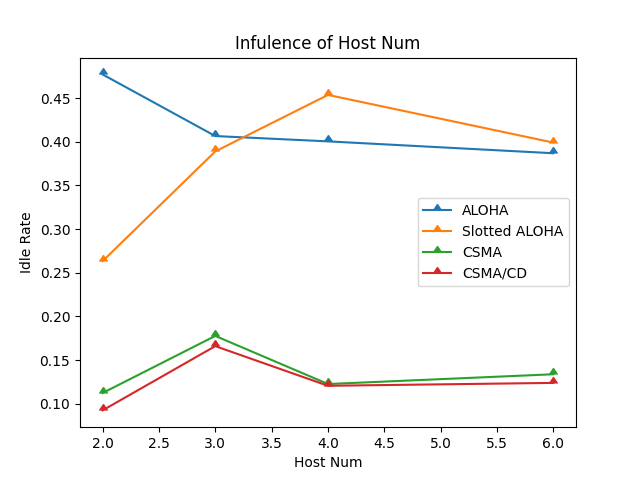

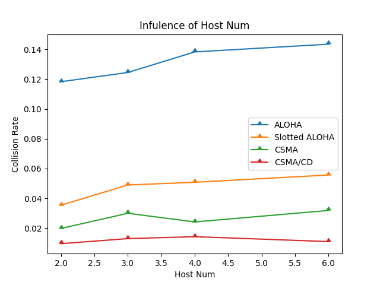

### Question 4

>   What’s the influence of `coefficient` in all methods. Apply the following settings, plot the results, and describe them.

With the higher coefficient, the success rate will slightly increase. On the other hand, we can see that the collision rate will be lower and lower if we increase the coefficient.

It is obvious that the success rate of CSMA and CSMA/CD is always higher thant ALOHA and Slotted ALOHA.

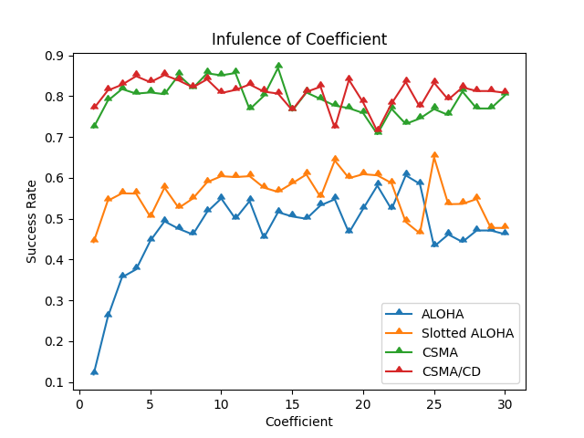

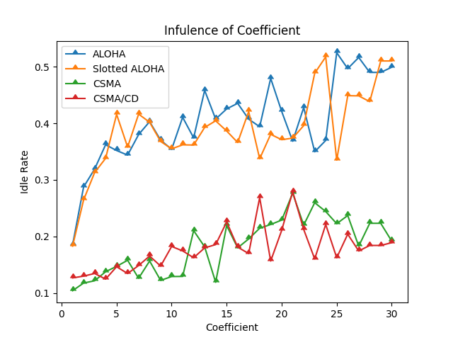

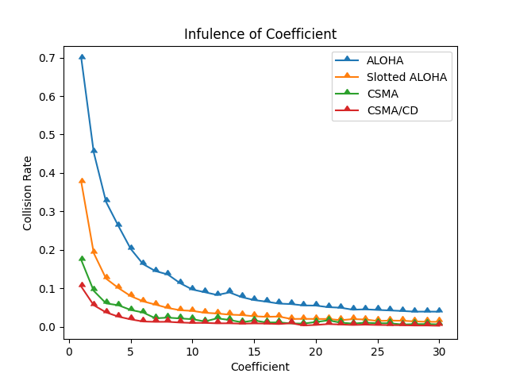

### Question 5

>   What’s the influence of `packet_num` in all methods. Apply the following settings, plot the results, and describe them.

The more number of packets each host need to send, the success rate for CSMA and CSMA/CD will increase significant. That is because they don't have enough packet to fill up the total time to send with few packets. Similary, the success rate for ALOHA and Slotted ALOHA will increase, too. However, since they did not do carrier sense, thus they waste their time for idle and collision, that cause the lower success rate.

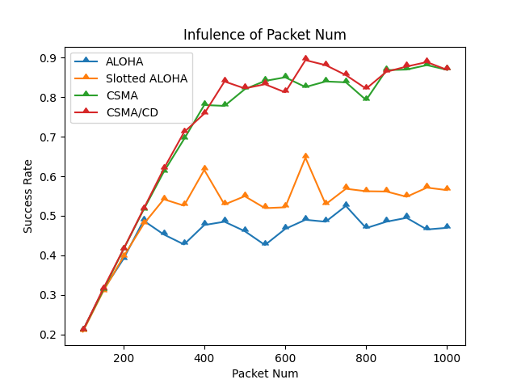

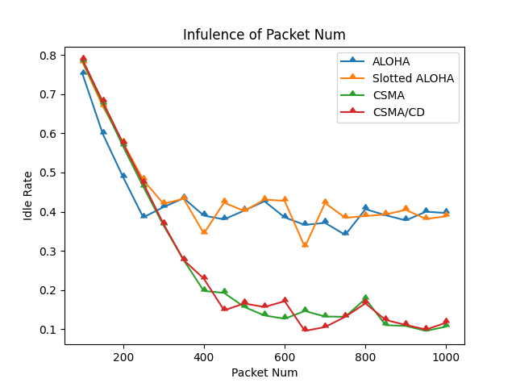

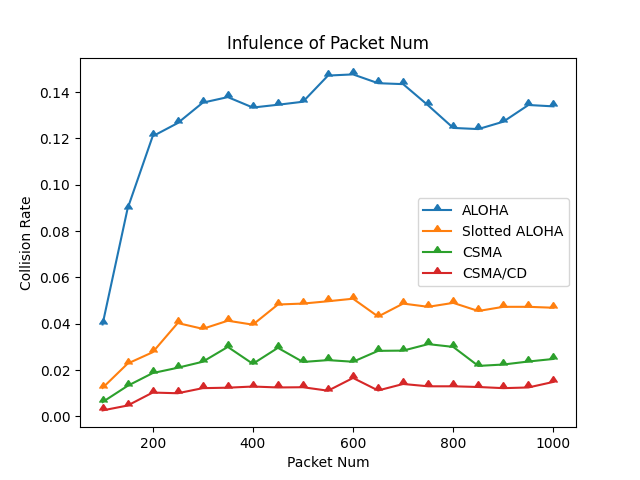

### Question 6

>   What’s the influence of `host_num` in all methods. Apply the following settings, plot the results, and describe them.

Since we didn't fix the total number of packet in every scenario, that is the more host there are, the more packet it will be. Thus, this result will be similar to Question 5. The more packet needed to transmit, the more utilization of the channel will be for CSMA and CSMA/CD, since they did carrier sense.

In contrast, ALOHA and Slotted ALOHA won't have significant change.

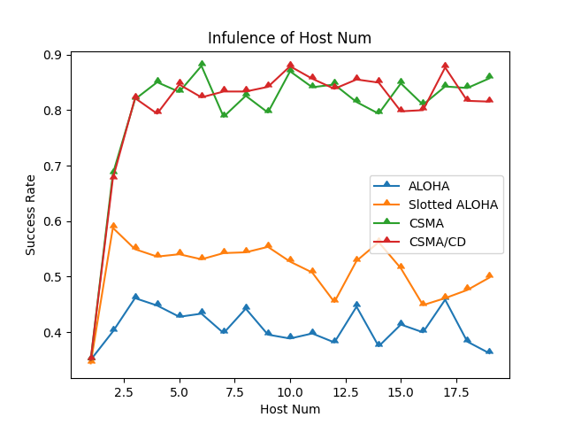

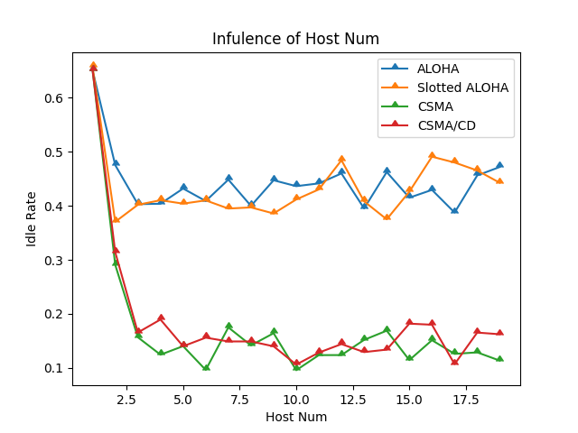

### Question 7

>   What’s the influence of `packet_size` in all methods. Apply the following settings, plot the results, and describe them.

The packet size will not have significant effect with ALOHA and Slotted ALOHA. However, the reason why the success rate increase for CSMA and CSMA/CD is that there are not enough packet needed to be transmit for them to fully utilize the channel, it can be proved by it's low collision rate. Moreover, since they do carrier sense before they send the packet, they won't interrupt the host who is already sending the packet. Thus, the longer the packet size is, the higher the utilization of the channel will be since the succussful packets will occupy more time slot if some host had not been curropted for at least the link delay time.

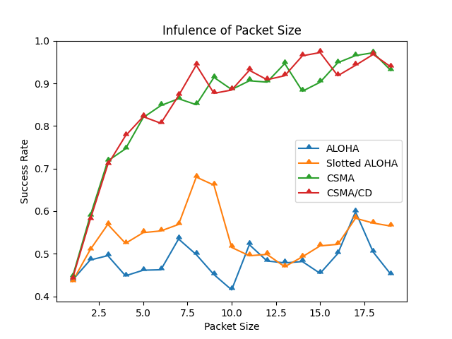

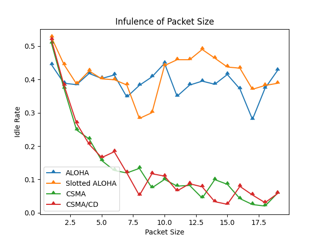

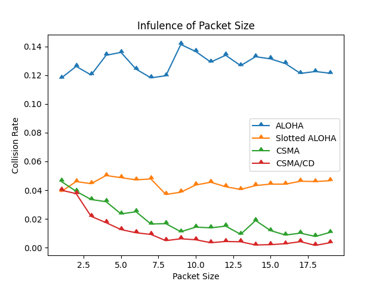

### Question 8

>   What’s the influence of `link_delay` in CSMA and CSMA/CD? Apply the following settings, plot the results, and describe them.

Since ALOHA and Slotted ALOHA does not take link delay into consideration, they won't have any effect for this experience.

The higher the link delay is, the lower the success rate will be for CSMA and CSMA/CD, scince they will misdetected whether other host are sending or not while the packet is still flowing on the link with some delay. That is to say, with the higher link delay, their will be higher collision rate. What's more, since all hosts using CSMA/CD will stop sending when detected collision and wait for a period, the idle time will slightly increase for this reason.

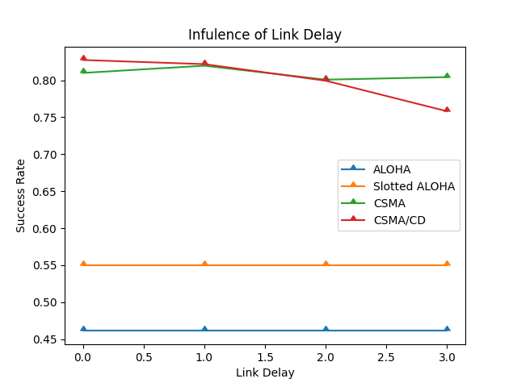

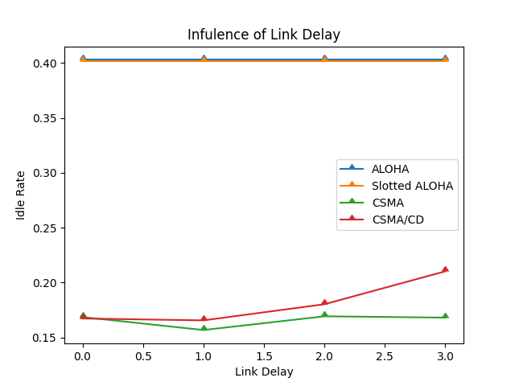

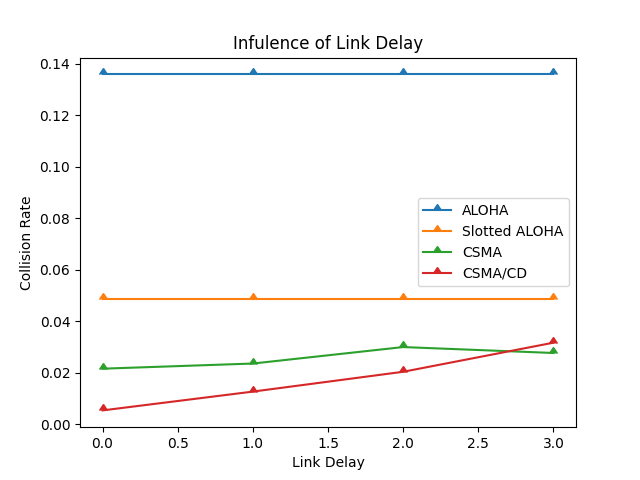

